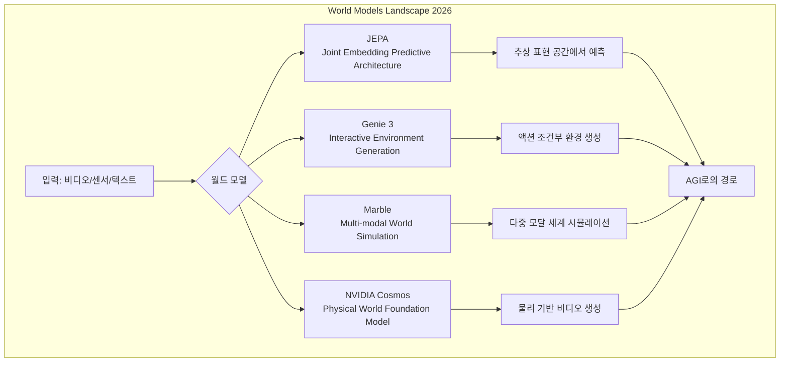
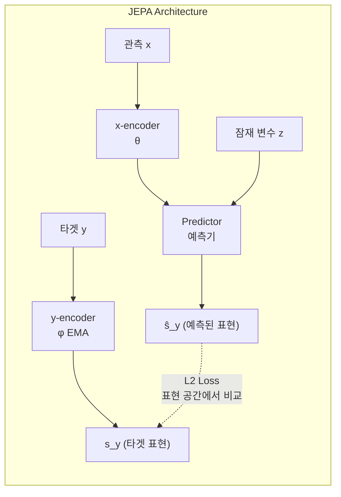

## 도입: 왜 월드 모델인가?

2025년을 지나며 우리는 대규모 언어 모델(Large Language Model, LLM)의 놀라운 성장을 목격했습니다. GPT-4, Claude 3.5, Gemini Ultra 등은 텍스트 생성과 추론에서 인간에 근접한 성능을 보여주었죠. 하지만 한 가지 근본적인 질문이 남아 있었습니다. **"이 모델들이 정말로 세상을 '이해'하고 있는가?"** LLM은 토큰의 통계적 패턴을 학습할 뿐, 물리 법칙을 따르는 공이 어떻게 굴러가는지, 컵을 기울이면 물이 왜 쏟아지는지를 체화(embody)하지 못합니다. 이것이 바로 **월드 모델(World Models)**이 주목받는 이유입니다.

월드 모델은 세상의 인과관계(causality), 물리적 역학(physics dynamics), 시공간적 연속성(spatiotemporal continuity)을 내재적으로 학습하는 모델입니다. Yann LeCun이 2022년부터 역설해온 것처럼, 진정한 AGI(Artificial General Intelligence)에 도달하려면 단순한 언어 패턴 매칭을 넘어 **세계의 내부 시뮬레이션(internal simulation)**을 구축할 수 있어야 합니다. 2026년 현재, JEPA, Google DeepMind의 Genie 3, Marble, 그리고 NVIDIA Cosmos가 이 비전을 현실로 만들어가고 있습니다.

이 글에서는 네 가지 대표적인 월드 모델 아키텍처를 기술적으로 비교하고, 실제로 이들을 활용하는 방법을 코드와 함께 살펴보겠습니다. 클라우드 인프라 위에서 이러한 모델들을 배포하고 서빙하는 실전 전략까지 다루겠습니다.

---

## 핵심 내용: 네 가지 월드 모델 아키텍처 심층 비교

### 전체 아키텍처 비교


<details><summary>Mermaid 소스</summary>



</details>

### 1. JEPA (Joint Embedding Predictive Architecture)

Yann LeCun이 Meta AI에서 주도하는 JEPA는 월드 모델의 **철학적 토대**에 가장 가깝습니다. 핵심 아이디어는 단순합니다: **픽셀 수준이 아닌 추상 표현 공간(abstract representation space)에서 예측하라.**

기존의 생성 모델(Generative Model)은 다음 프레임의 모든 픽셀을 예측하려 합니다. 이는 엄청난 계산 낭비이며, 본질적으로 불확실한 세부사항(나뭇잎의 정확한 위치 등)까지 예측하게 만듭니다. JEPA는 이를 피하고, **의미적으로 중요한 추상적 특징(semantic features)**만 예측합니다.


<details><summary>Mermaid 소스</summary>



</details>

**V-JEPA 2 (2025 후반 공개)**는 비디오 이해에서 놀라운 성과를 보였으며, 2026년 초 공개된 **V-JEPA 3**는 액션 조건부 예측(action-conditioned prediction)까지 지원합니다.

```python
import torch
import torch.nn as nn

class JEPAPredictor(nn.Module):
    """
    JEPA 스타일의 표현 공간 예측기 (Simplified)
    핵심: 픽셀이 아닌 임베딩 공간에서 미래를 예측
    """
    def __init__(self, embed_dim=768, latent_dim=256, num_heads=12, depth=6):
        super().__init__()
        self.latent_proj = nn.Linear(latent_dim, embed_dim)
        
        # Transformer 기반 예측기
        encoder_layer = nn.TransformerEncoderLayer(
            d_model=embed_dim,
            nhead=num_heads,
            dim_feedforward=embed_dim * 4,
            batch_first=True
        )
        self.predictor = nn.TransformerEncoder(encoder_layer, num_layers=depth)
        self.output_proj = nn.Linear(embed_dim, embed_dim)
    
    def forward(self, context_embeddings, latent_variable):
        """
        Args:
            context_embeddings: x-encoder 출력 [B, T, D]
            latent_variable: 불확실성을 인코딩하는 잠재 변수 z [B, L]
        Returns:
            predicted_target: 타겟의 예측된 표현 [B, T', D]
        """
        z = self.latent_proj(latent_variable).unsqueeze(1)  # [B, 1, D]
        
        # 컨텍스트와 잠재 변수를 결합
        combined = torch.cat([context_embeddings, z], dim=1)
        
        # Transformer를 통한 예측
        predicted = self.predictor(combined)
        
        # 잠재 변수 토큰 제외, 타겟 위치만 추출
        predicted_target = self.output_proj(predicted[:, :-1, :])
        return predicted_target


class VJEPAWorldModel(nn.Module):
    """V-JEPA 스타일 월드 모델 — 비디오에서 세계 역학 학습"""
    def __init__(self, embed_dim=768):
        super().__init__()
        self.x_encoder = VisionTransformer(embed_dim=embed_dim)  # 컨텍스트 인코더
        self.y_encoder = VisionTransformer(embed_dim=embed_dim)  # 타겟 인코더 (EMA)
        self.predictor = JEPAPredictor(embed_dim=embed_dim)
        
        # y_encoder는 x_encoder의 EMA (Exponential Moving Average)
        self._ema_decay = 0.996
    
    @torch.no_grad()
    def update_target_encoder(self):
        """타겟 인코더를 EMA로 업데이트 — 표현 붕괴(collapse) 방지"""
        for param_x, param_y in zip(
            self.x_encoder.parameters(), 
            self.y_encoder.parameters()
        ):
            param_y.data = (
                self._ema_decay * param_y.data 
                + (1 - self._ema_decay) * param_x.data
            )
    
    def forward(self, video_context, video_target, latent_z):
        # 컨텍스트 프레임 인코딩
        sx = self.x_encoder(video_context)
        
        # 타겟 프레임 인코딩 (gradient 차단)
        with torch.no_grad():
            sy = self.y_encoder(video_target)
        
        # 표현 공간에서 타겟 예측
        sy_hat = self.predictor(sx, latent_z)
        
        # L2 Loss in representation space
        loss = nn.functional.mse_loss(sy_hat, sy)
        return loss, sy_hat
```

**JEPA의 핵심 강점:**
- 표현 붕괴(representation collapse)를 EMA + 비대칭 구조로 방지
- 생성 모델 대비 계산 효율성 극대화
- 불확실성을 잠재 변수 `z`로 명시적 모델링

### 2. Genie 3 (Google DeepMind)

Genie 시리즈는 **인터랙티브 환경 생성**에 초점을 맞춥니다. 2024년의 Genie 2가 단일 이미지에서 플레이 가능한 3D 환경을 생성했다면, **Genie 3 (2025 말 공개)**는 더 나아가 **장기 일관성(long-horizon consistency)**과 **물리적 그럴듯함(physical plausibility)**을 크게 개선했습니다.

```python
class Genie3ActionTokenizer:
    """
    Genie 3의 핵심 혁신: Latent Action Model (LAM)
    레이블 없는 비디오에서 액션을 자동으로 발견
    """
    def __init__(self, num_actions=512, codebook_dim=32):
        self.num_actions = num_actions
        self.codebook_dim = codebook_dim
        # VQ-VAE 스타일의 액션 코드북
        self.codebook = nn.Embedding(num_actions, codebook_dim)
    
    def infer_action(self, frame_t, frame_t1):
        """
        연속된 두 프레임 사이의 '액션'을 추론
        — 라벨 없이 비디오만으로 학습 가능!
        """
        # 두 프레임의 차이에서 액션 임베딩 추출
        diff_embedding = self.action_encoder(frame_t, frame_t1)
        
        # 가장 가까운 코드북 벡터 찾기 (VQ)
        distances = torch.cdist(
            diff_embedding.unsqueeze(1), 
            self.codebook.weight.unsqueeze(0)
        )
        action_tokens = distances.argmin(dim=-1)
        return action_tokens


class Genie3WorldModel(nn.Module):
    """
    Genie 3: 액션 조건부 비디오 생성 월드 모델
    핵심 = Spatial-Temporal Transformer + Latent Action Model
    """
    def __init__(self, vocab_size=8192, action_vocab=512):
        super().__init__()
        self.video_tokenizer = VideoVQVAE(vocab_size=vocab_size)
        self.action_tokenizer = Genie3ActionTokenizer(num_actions=action_vocab)
        
        # MaskGIT 스타일의 병렬 디코딩을 위한 Transformer
        self.dynamics_model = SpatioTemporalTransformer(
            vocab_size=vocab_size + action_vocab,
            num_layers=24,
            num_heads=16,
            embed_dim=1024
        )
    
    def generate_next_frame(self, current_frames, action):
        """
        현재 프레임 + 액션 → 다음 프레임 생성
        MaskGIT 방식으로 병렬 디코딩하여 속도 확보
        """
        video_tokens = self.video_tokenizer.encode(current_frames)
        
        # 액션 토큰과 비디오 토큰을 인터리빙
        combined = interleave_tokens(video_tokens, action)
        
        # 마스킹된 토큰을 반복적으로 예측 (MaskGIT)
        predicted_tokens = self.dynamics_model.parallel_decode(
            combined, 
            num_iterations=8  # 8회 반복으로 전체 프레임 생성
        )
        
        next_frame = self.video_tokenizer.decode(predicted_tokens)
        return next_frame
```

**Genie 3의 차별점:**
- **Latent Action Model**: 비디오에서 액션을 비지도(unsupervised)로 발견
- **MaskGIT 디코딩**: 자기회귀(autoregressive) 대비 10배 이상 빠른 생성
- **게임/로보틱스 시뮬레이터**