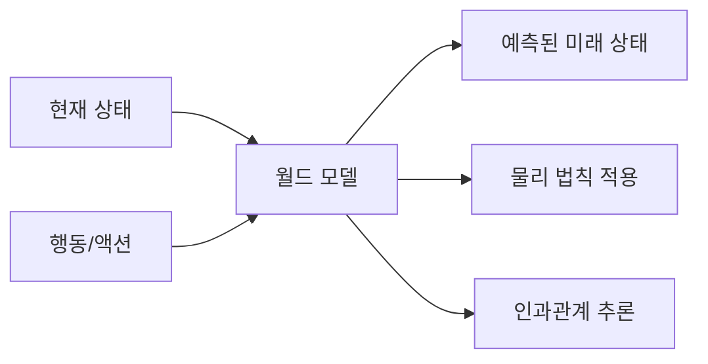
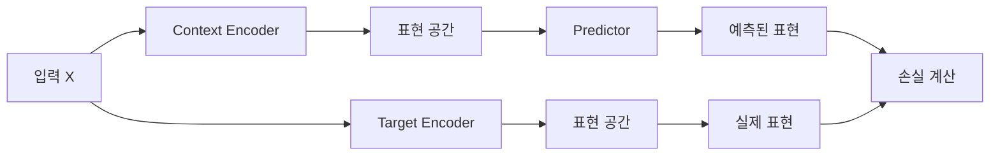
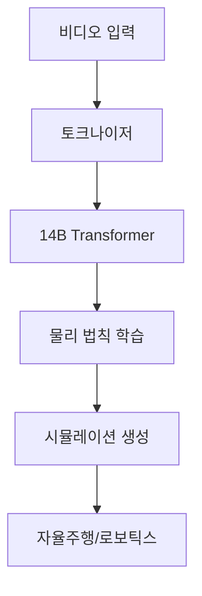
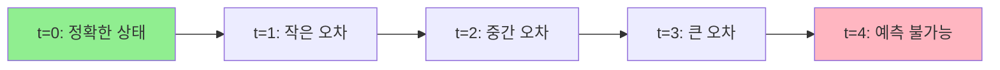

## 월드 모델이란 무엇인가: AI가 세상을 시뮬레이션하는 방법

월드 모델(World Model)은 AI가 현실 세계의 물리적 법칙과 인과관계를 학습하여 미래 상태를 예측하는 시스템입니다. 기존 언어 모델이 텍스트의 통계적 패턴을 학습한다면, 월드 모델은 시각적 정보를 기반으로 "만약 이 행동을 하면 어떤 일이 일어날까?"를 시뮬레이션합니다.


<details><summary>Mermaid 소스</summary>



</details>

핵심은 단순한 픽셀 예측을 넘어 **물리적 일관성**을 유지하는 것입니다. 예를 들어, 공이 떨어지면 중력에 따라 가속하고, 벽에 부딪히면 반사되는 물리 법칙을 이해해야 합니다.

```python
# 월드 모델의 기본 구조 (개념적)
class WorldModel:
    def predict_next_frame(self, current_state, action):
        # 물리 법칙과 인과관계를 고려한 예측
        return self.physics_engine(current_state, action)
```

응용 분야는 무궁무진합니다. 게임 AI에서는 NPC가 환경과 상호작용하는 방식을 학습하고, 자율주행에서는 다른 차량과 보행자의 행동을 예측합니다. 로보틱스 분야에서는 로봇이 물체를 조작할 때의 결과를 미리 시뮬레이션하여 더 정확한 작업을 수행할 수 있게 됩니다.

## Yann LeCun의 JEPA: 자기지도학습으로 세상 이해하기

Yann LeCun이 제안한 JEPA(Joint Embedding Predictive Architecture)는 월드 모델 구축을 위한 혁신적인 접근법입니다. JEPA의 핵심 아이디어는 **표현 공간(representation space)**에서 예측을 수행하여 픽셀 단위의 생성 없이도 세상의 구조를 학습하는 것입니다.


<details><summary>Mermaid 소스</summary>



</details>

JEPA는 마스킹 기법을 활용해 입력의 일부분으로부터 나머지 부분을 예측하도록 학습합니다. 이때 중요한 것은 **픽셀을 직접 생성하지 않고**, 고차원 표현 공간에서 의미론적 특징을 예측한다는 점입니다.

**I-JEPA**(Image-based JEPA)는 이미지의 마스킹된 영역을 표현 공간에서 예측하여 객체의 구조와 관계를 학습합니다. **V-JEPA**(Video-based JEPA)는 비디오 시퀀스에서 시간적 일관성을 학습하여 동작과 변화를 이해합니다.

```python
# I-JEPA 기본 구조 예시
class IJEPA(nn.Module):
    def __init__(self):
        self.context_encoder = VisionTransformer()
        self.target_encoder = VisionTransformer()
        self.predictor = MLP()
    
    def forward(self, x_context, x_target):
        context_repr = self.context_encoder(x_context)
        target_repr = self.target_encoder(x_target)
        predicted_repr = self.predictor(context_repr)
        
        loss = F.mse_loss(predicted_repr, target_repr)
        return loss
```

JEPA의 장점은 **계산 효율성**과 **의미론적 추상화**입니다. 하지만 표현 공간의 품질에 크게 의존하며, 복잡한 동역학을 완전히 포착하기에는 한계가 있습니다.

## NVIDIA Cosmos: 물리 AI를 위한 비디오 생성 모델

NVIDIA가 2024년 말 공개한 Cosmos-1.0은 물리 법칙을 이해하는 비디오 생성 월드 모델입니다. 14B 파라미터를 가진 이 모델은 단순한 비디오 생성을 넘어 현실 세계의 물리적 상호작용을 학습합니다.


<details><summary>Mermaid 소스</summary>



</details>

Cosmos의 핵심은 토크나이저 기반 접근법입니다. 비디오를 토큰으로 변환하여 언어 모델처럼 처리하면서, 물체의 움직임, 충돌, 중력 등 물리 법칙을 자연스럽게 학습합니다.

```python
# Cosmos 스타일 비디오 토큰화 개념
def tokenize_video(video_frames):
    # 비디오 프레임을 토큰으로 변환
    tokens = video_tokenizer.encode(video_frames)
    # 물리적 일관성을 고려한 예측
    next_tokens = cosmos_model.predict(tokens, physics_aware=True)
    return tokens, next_tokens
```

실제 활용에서 Cosmos는 자율주행 시나리오 시뮬레이션과 로봇 훈련 환경 생성에 탁월한 성능을 보입니다. 특히 실제 물리 법칙을 따르는 가상 환경을 생성하여, 현실에서 위험하거나 비용이 많이 드는 상황을 안전하게 시뮬레이션할 수 있게 해줍니다.

## 월드 모델의 기술적 도전과 미래 전망

월드 모델이 실용적인 AGI로 발전하기 위해서는 여러 근본적인 기술적 난제들을 해결해야 합니다.

### 장기 예측의 오차 누적 문제

가장 큰 도전은 **오차 누적(Error Accumulation)** 문제입니다. 시간이 지날수록 예측 오차가 기하급수적으로 증가하여 장기 계획 수립이 어려워집니다.


<details><summary>Mermaid 소스</summary>



</details>

해결 방안으로는 **계층적 추상화(Hierarchical Abstraction)**와 **불확실성 정량화(Uncertainty Quantification)**가 제시되고 있습니다.

### 멀티모달 학습의 복잡성

시각, 청각, 촉각 등 다양한 감각 정보를 통합하는 **멀티모달 학습(Multimodal Learning)**은 엄청난 계산 복잡도를 요구합니다. 실시간 추론을 위해서는 효율적인 어텐션 메커니즘과 압축 기법이 필수적입니다.

### AGI를 향한 월드 모델의 역할

월드 모델은 AGI의 핵심 구성 요소로 여겨지지만, **인과 추론(Causal Reasoning)**과 **상식 추론(Common Sense Reasoning)** 능력에서는 여전히 한계를 보입니다. 진정한 세상 이해를 위해서는 단순한 패턴 매칭을 넘어선 추상적 사고 능력이 필요합니다.

## References

1. LeCun, Y. (2022). "A Path Towards Autonomous Machine Intelligence Version 0.9.2, 2022-06-27." Meta AI Research. https://openreview.net/pdf?id=BZ5a1r-kVsf

2. Assran, M., Duval, Q., Misra, I., Bojanowski, P., Vincent, P., Rabbat, M., & LeCun, Y. (2023). "Self-Supervised Learning from Images with a Joint-Embedding Predictive Architecture." arXiv preprint arXiv:2301.08243. https://arxiv.org/abs/2301.08243

3. NVIDIA. (2024). "Cosmos: World Foundation Models for Video Generation." NVIDIA Research Blog. https://research.nvidia.com/labs/dir/cosmos/

4. NVIDIA. (2024). "Cosmos Technical Report: Scaling World Foundation Models." https://cosmos-world-models.github.io/

5. Ha, D., & Schmidhuber, J. (2018). "World Models." arXiv preprint arXiv:1803.10122. https://arxiv.org/abs/1803.10122

6. Hafner, D., Lillicrap, T., Fischer, I., Villegas, R., Ha, D., Lee, H., & Davidson, J. (2019). "Learning Latent Dynamics for Planning from Pixels." International Conference on Machine Learning (ICML). https://arxiv.org/abs/1811.04551

7. OpenAI. (2024). "Sora: Creating video from text." OpenAI Technical Report. https://openai.com/sora

8. Finn, C., & Levine, S. (2017). "Deep Visual Foresight for Planning Robot Motion." IEEE International Conference on Robotics and Automation (ICRA). https://arxiv.org/abs/1610.00696

9. Kaiser, L., Babaeizadeh, M., Milos, P., Osinski, B., Campbell, R. H., Czechowski, K., ... & Lev